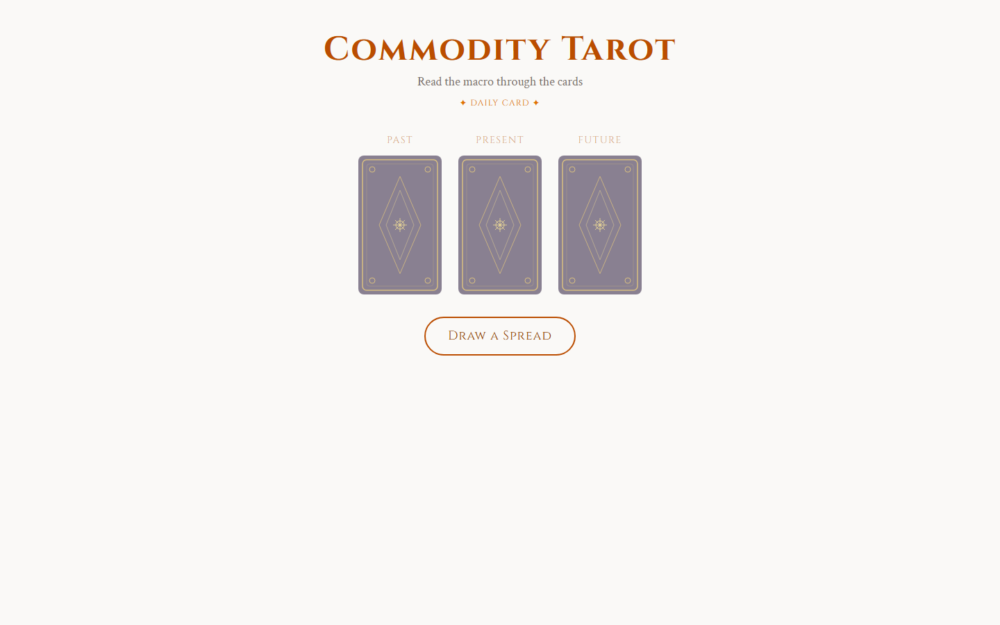
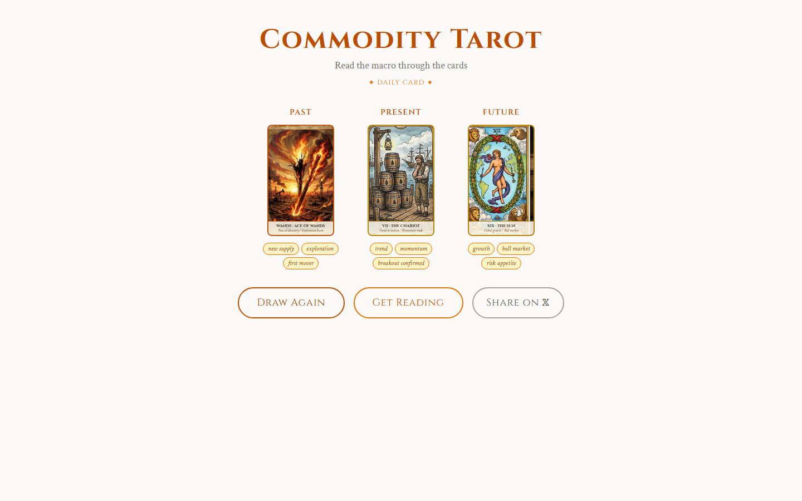
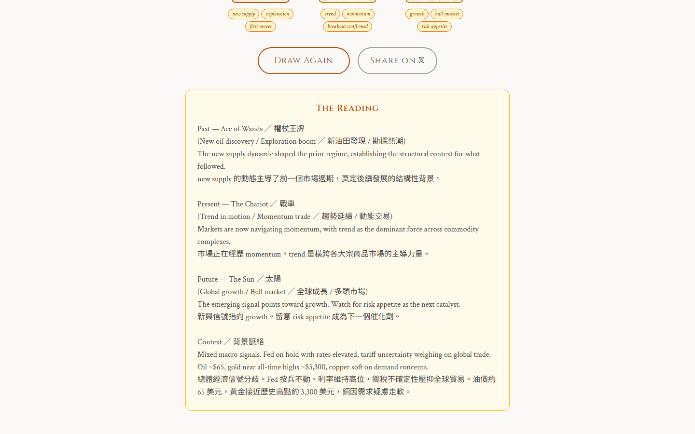

<div align="center">

# Commodity Tarot 🃏

### 用塔羅的語言，讀懂大宗商品市場。

[English](./README.md) · **繁體中文**

[](https://commodity-tarot.vercel.app)
[](./LICENSE)
[](https://react.dev)
[](https://vitejs.dev)



</div>

---

## ✨ 這是什麼？

一個 React 單頁應用，把 **78 張塔羅牌** 映射到大宗商品市場的週期與主題。抽一個「過去 / 現在 / 未來」三牌陣，獲得一段解讀——用塔羅的象徵語言來觀察當下的總體經濟環境。

這不是預測工具，而是一個 **思考框架**。牌不給你答案，牌給你**視角**。

---

## 🎯 功能特色

- 🎴 **全 78 張牌** 都有客製化的商品主題插圖（AI 生成）
- 🔮 **三牌陣**（過去 / 現在 / 未來）搭配 CSS 翻牌動畫
- 📅 **每日一牌** — 以日期為種子，全球所有使用者同一天看到同一張牌
- 🌏 **中英雙語解讀** — 英文與繁中並列顯示
- 🤖 **可選 AI 解讀** — 接上你的 Anthropic API key，由 Claude 結合即時商品價格生成個人化解讀
- 🐦 **一鍵分享到 X/Twitter** — 帶上牌名與主題

---

## 🚀 線上試玩

👉 **[commodity-tarot.vercel.app](https://commodity-tarot.vercel.app)**

---

## 📸 截圖

| 三牌陣 | 中英雙語解讀 |
|:-:|:-:|
|  |  |

---

## 🎴 牌 → 市場 對應表

### 小阿爾克那花色 → 商品板塊

| 花色 | 板塊 | 涵蓋 |
|------|--------|--------|
| 🔥 **權杖** | 能源 | 原油、天然氣、電力 —— 供給衝擊、地緣政治、OPEC 動態 |
| 🪙 **星幣** | 金屬 | 黃金、白銀、銅、鋰 —— 價值儲存、工業需求 |
| ☕ **聖杯** | 軟商品 | 咖啡、可可、糖、棉花 —— 天氣循環、新興市場消費 |
| 🌾 **寶劍** | 糧食 | 玉米、小麥、大豆、稻米 —— 糧食安全、貿易戰、物流 |

### 大阿爾克那 → 宏觀市場週期

| # | 牌 | 市場週期／情境 |
|---|------|-------------|
| 0 | 愚者 | 風險偏好開啟／新週期啟動 |
| I | 魔術師 | 央行全能／流動性憑空造就 |
| II | 女祭司 | 隱藏資訊／價格發現待定 |
| III | 女皇 | 通貨膨脹／大宗商品超級週期 |
| IV | 皇帝 | 升息／貨幣緊縮 |
| V | 教皇 | OPEC+ 紀律／卡特爾正統 |
| VI | 戀人 | 貿易協定／市場相關性走高 |
| VII | 戰車 | 趨勢延續／動能交易 |
| VIII | 力量 | 長期結構性需求／耐心資本 |
| IX | 隱士 | 通縮／低波動收縮 |
| X | 命運之輪 | 供給衝擊／週期反轉 |
| XI | 正義 | 法規再平衡／市場修正 |
| XII | 倒吊人 | 衰退／需求破壞 |
| XIII | 死神 | 政策易轍／週期終結 |
| XIV | 節制 | 軟著陸／受控放緩 |
| XV | 惡魔 | 槓桿／商品成癮 |
| XVI | 高塔 | 波動率飆升／黑天鵝 |
| XVII | 星星 | 復甦／流動性回歸 |
| XVIII | 月亮 | 不確定性／情緒主導市場 |
| XIX | 太陽 | 全球成長／多頭市場 |
| XX | 審判 | 政策轉向／Fed 翻轉 |
| XXI | 世界 | 完整週期收尾／頂峰繁榮 |

完整的 56 張小阿爾克那對應表定義在 [`src/data/arcana.json`](./src/data/arcana.json) —— 每張牌都有 `macro_mapping`、`keywords`、`sector`，以及中文欄位 `name_zh`、`macro_mapping_zh`。

---

## 🛠️ 快速開始

### 需求

- Node.js 20 或以上、npm

### 安裝與啟動

```bash
git clone https://github.com/Chimmy-Ultra/commodity-tarot.git
cd commodity-tarot
npm install
npm run dev
```

瀏覽器開 <http://localhost:5173>。

### 打包正式版

```bash
npm run build
npm run preview    # 本機預覽打包後的成果
```

---

## ⚙️ 環境變數（選用）

複製 `.env.example` 為 `.env` 並填入你有的 key。**兩個都是選用**，不填也可以跑——會顯示雙語預設解讀與預設市場快照。

| 變數 | 用途 | 取得 key |
|----------|---------|-----------|
| `VITE_ANTHROPIC_KEY` | 啟用 Claude 即時解讀 | [console.anthropic.com](https://console.anthropic.com) |
| `VITE_ALPHA_VANTAGE_KEY` | 抓取即時商品價格餵給解讀 | [alphavantage.co](https://www.alphavantage.co/support/#api-key) |

> ⚠️ 這些是 `VITE_` 前綴的變數，**會被打包進前端 JS**。不要放共用的正式 key，否則其他人會從 DevTools 直接看到。最佳做法：自己部署、用自己的額度；或讓每位使用者在 UI 上貼自己的 key（此功能待開發）。

---

## 🏗️ 架構

```
 使用者互動
      │
      ▼
 CardDraw.jsx ／ DailyCard.jsx
      │
      ▼
 seedrng.js    ───►  隨機洗牌（三牌陣）或日期種子（每日一牌）
      │
      ▼
 arcana.json  ───►  78 張牌 × {name, name_zh, macro_mapping,
      │                       macro_mapping_zh, keywords,
      │                       sector, image_prompt}
      ▼
 market.js    ───►  Alpha Vantage 即時商品價格（有 key 才抓）
      │              · 根據抽到牌的 sector 挑商品
      │              · 4 小時 sessionStorage 快取
      ▼
 reading.js   ───►  Claude API（有 key 才呼叫）
      │              prompt = 市場快照 + 三張牌 + 關鍵字
      │              否則 fallback 到中英雙語 stub
      ▼
 解讀呈現在 CardDraw.jsx
```

---

## 📁 專案結構

```
commodity-tarot/
├── src/
│   ├── App.jsx                  # 路由（Hash）：# / → 牌陣、#/daily → 每日牌
│   ├── components/
│   │   ├── CardDraw.jsx         # 三牌陣與翻牌動畫
│   │   └── DailyCard.jsx        # 每日一牌（日期種子）
│   ├── data/
│   │   ├── arcana.json          # 全 78 張牌，含雙語欄位
│   │   └── cardImages.js        # 單一真實來源：id → 圖片路徑
│   └── lib/
│       ├── reading.js           # Claude API + 中英雙語 stub
│       ├── seedrng.js           # Mulberry32 亂數 + Fisher-Yates 洗牌
│       └── market.js            # Alpha Vantage 整合
├── public/
│   └── cards/                   # 78 張 PNG 插圖
├── scripts/
│   ├── generate-images.mjs      # Gemini Imagen 3 批次產圖
│   ├── gen-minor-images.mjs     # 只產小阿爾克那的輔助腳本
│   └── take-screenshots.mjs     # Puppeteer 截圖自動化
├── docs/screenshots/            # README 截圖
├── vercel.json                  # Vercel SPA 路由設定
└── vite.config.js               # /api/anthropic + /api/alphavantage 開發 proxy
```

---

## 🎨 重新產生卡片插圖（給貢獻者）

卡片插圖是用 Google Gemini Imagen 3 產的，每張牌的 `image_prompt` 欄位在 `arcana.json` 裡。

要重新生成（或新增牌）：

```bash
# 1. 在 .env 加入 GEMINI_API_KEY
#    （https://aistudio.google.com/apikey）
# 2. 執行：
node scripts/generate-images.mjs --suit wands          # 一整個花色
node scripts/generate-images.mjs --id 42               # 單張牌
node scripts/generate-images.mjs --dry-run             # 只列 prompt 不呼叫
```

輸出會存到 `public/cards/`。腳本限速 ~15 RPM 以符合 Gemini 免費額度。

---

## 🚢 部署到 Vercel（一鍵）

1. 用 GitHub 帳號登入 [vercel.com](https://vercel.com)
2. 點 **"Add New Project"**，匯入你 fork 的 repo
3. 接受自動偵測的 Vite 設定 → 點 **Deploy**
4. 之後每次 `git push`，Vercel 都會自動重新部署

`vercel.json` 處理 SPA 路由：除了 `/cards/*` 外的所有路徑都回傳 `index.html`。

### 選用：在正式站上啟用即時解讀

到 Vercel → Project Settings → Environment Variables，加入 `VITE_ANTHROPIC_KEY` 或 `VITE_ALPHA_VANTAGE_KEY`。**注意上面提過的打包警告。**

---

## 🤝 貢獻

歡迎貢獻！新手友善的題目：

- **改善牌義解讀**：編輯 [`arcana.json`](./src/data/arcana.json) 的 `macro_mapping` / `macro_mapping_zh` / `keywords`
- **重畫某張卡**：改寫該牌的 `image_prompt` 並重新產圖
- **新增市場快照來源**：擴充 `src/lib/market.js`
- **UI 優化**：翻牌動畫、手機排版、暗黑模式

Fork → 開 branch → commit → 發 PR。保持 PR 聚焦。

---

## ⚠️ 免責聲明

這是一個 **思考框架**、一個輔助反思的工具，**不是預測引擎也不是交易訊號**。

- 解讀是敘事性詮釋，不是預測
- 不要根據抽到的牌做投資決策
- 商品市場複雜性極高；這裡的對應是象徵性的，不是操作性的

---

## 📜 授權

[MIT](./LICENSE) © Chimmy-Ultra

---

## 🙏 感謝

- **[Claude (Anthropic)](https://anthropic.com)** — 解讀敘事生成
- **[Google Gemini Imagen 3](https://ai.google.dev)** — 卡片插圖
- **[Alpha Vantage](https://www.alphavantage.co)** — 商品市場數據
- Rider-Waite-Smith 塔羅結構作為牌意原型
